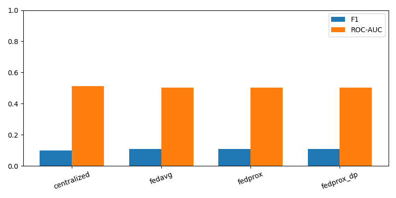

# ChestMNIST Benchmark Report

This report contains measured ChestMNIST validation benchmark results. It is not clinical validation.

## Setup

- Seeds: [42, 123, 2026]
- Baselines: ['centralized', 'fedavg', 'fedprox', 'fedprox_dp']
- Rounds: 1
- Local epochs: 1
- Batch size: 64
- Clients: 3
- Samples per client: 512
- Test evaluation limit: 4096 sampled test images

## Split Verification

```json
{
  "train": {
    "num_samples": 78468,
    "label_shape": [
      78468,
      14
    ],
    "positive_counts": [
      7996,
      1950,
      9261,
      13914,
      3988,
      4375,
      978,
      3705,
      3263,
      1690,
      1799,
      1158,
      2279,
      144
    ],
    "positive_rates": [
      0.10190141204057705,
      0.02485089463220676,
      0.1180226334301881,
      0.17732069123719224,
      0.05082326553499516,
      0.0557552123158485,
      0.01246367946169139,
      0.04721669980119284,
      0.041583830351225974,
      0.021537442014579192,
      0.022926543304276903,
      0.014757608196972014,
      0.029043686598358567,
      0.001835142988224499
    ]
  },
  "val": {
    "num_samples": 11219,
    "label_shape": [
      11219,
      14
    ],
    "positive_counts": [
      1119,
      240,
      1292,
      2018,
      625,
      613,
      133,
      504,
      447,
      200,
      208,
      166,
      372,
      41
    ],
    "positive_rates": [
      0.09974150993849719,
      0.021392280951956503,
      0.11516177912469917,
      0.1798734290043676,
      0.05570906497905339,
      0.054639450931455565,
      0.011854889027542562,
      0.044923789999108656,
      0.039843123273018984,
      0.017826900793297084,
      0.01853997682502897,
      0.014796327658436581,
      0.03315803547553258,
      0.0036545146626259027
    ]
  },
  "test": {
    "num_samples": 22433,
    "label_shape": [
      22433,
      14
    ],
    "positive_counts": [
      2420,
      582,
      2754,
      3938,
      1133,
      1335,
      242,
      1089,
      957,
      413,
      509,
      362,
      734,
      42
    ],
    "positive_rates": [
      0.10787678865956403,
      0.025943921900771185,
      0.12276556858199973,
      0.1755449560914724,
      0.05050595105425044,
      0.05951054250434627,
      0.010787678865956404,
      0.048544554896803815,
      0.04266036642446396,
      0.01841037756876031,
      0.02268978736682566,
      0.01613694111353809,
      0.03271965408104132,
      0.0018722417866535908
    ]
  }
}
```

## Mean Metrics

| Baseline | Accuracy | Precision | Recall | F1 | ROC-AUC | Loss | Runtime (s) | Epsilon |
|---|---:|---:|---:|---:|---:|---:|---:|---:|
| centralized | 0.0000 +/- 0.0000 | 0.0545 +/- 0.0080 | 0.5416 +/- 0.0980 | 0.0989 +/- 0.0148 | 0.5117 +/- 0.0126 | 0.6905 +/- 0.0063 | 19.8333 +/- 0.8636 | Unavailable |
| fedavg | 0.0000 +/- 0.0000 | 0.0601 +/- 0.0062 | 0.5921 +/- 0.0260 | 0.1091 +/- 0.0106 | 0.5031 +/- 0.0157 | 0.6917 +/- 0.0039 | 19.4283 +/- 0.5403 | Unavailable |
| fedprox | 0.0000 +/- 0.0000 | 0.0601 +/- 0.0062 | 0.5921 +/- 0.0260 | 0.1091 +/- 0.0106 | 0.5028 +/- 0.0149 | 0.6917 +/- 0.0039 | 20.9300 +/- 1.5413 | Unavailable |
| fedprox_dp | 0.0000 +/- 0.0000 | 0.0601 +/- 0.0062 | 0.5921 +/- 0.0260 | 0.1091 +/- 0.0106 | 0.5016 +/- 0.0135 | 0.6918 +/- 0.0039 | 20.2124 +/- 0.0968 | 3.8521 +/- 0.0000 |

## Charts



## Observations

- All reported values are measured from the benchmark run artifacts.
- Exact-match multi-label accuracy is expected to be harsh for ChestMNIST.
- ROC-AUC is reported when each class has positive and negative examples in the evaluated sample.
- DP epsilon is reported only for the FedProx + DP baseline.

## Failed Experiments

None.

## Limitations

- This run uses a bounded client/test sample count to keep validation practical on local CPU.
- Results are benchmark evidence, not clinical evidence.
- No HIPAA, GDPR, production readiness, or diagnostic-safety claim is made.
