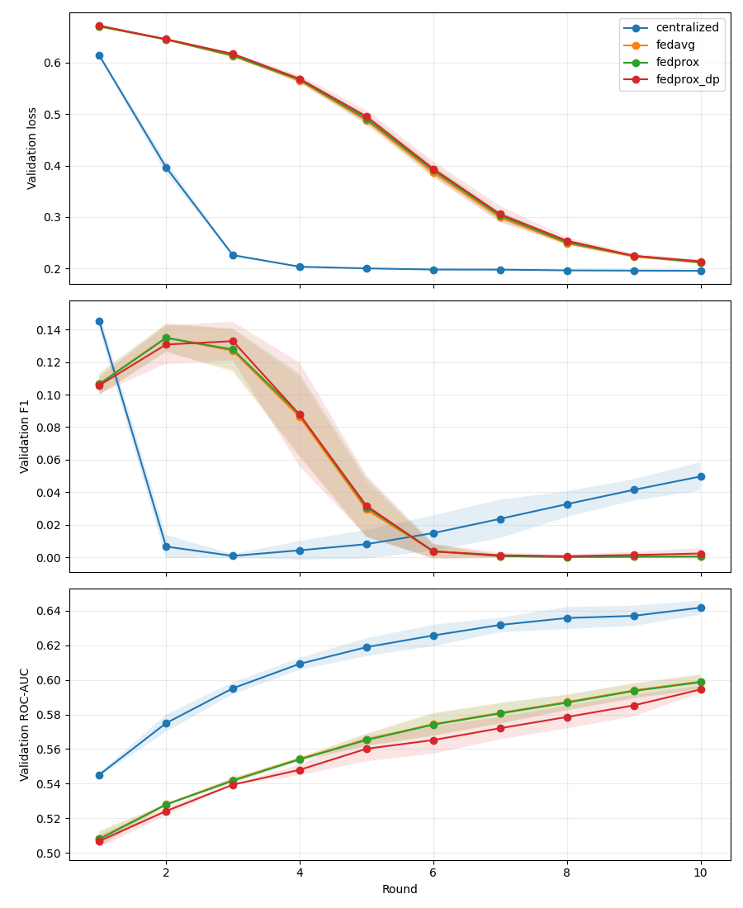
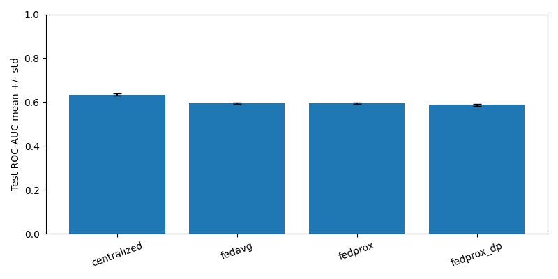
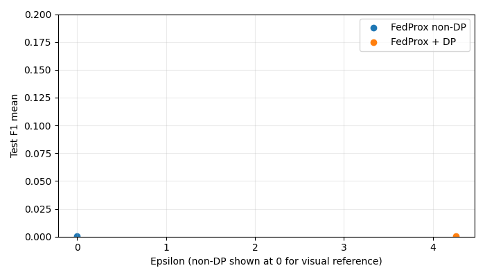

# ChestMNIST Research Results

This report contains measured large-scale ChestMNIST benchmark results from the local validation pipeline. It is research evidence only, not clinical validation or diagnostic software evidence.

## Setup

- Dataset: ChestMNIST
- Seeds: [42, 123, 2026]
- Baselines: ['centralized', 'fedavg', 'fedprox', 'fedprox_dp']
- Clients: 3
- Rounds: 10
- Local epochs: 2
- Batch size: 64
- Samples per client: 5000
- Validation evaluation: full validation split
- Test evaluation: full test split
- Device: cpu
- FedProx mu: 0.01
- DP noise multiplier: 1.2

## Split Verification

```json
{
  "train": {
    "num_samples": 78468,
    "label_shape": [
      78468,
      14
    ],
    "positive_counts": [
      7996,
      1950,
      9261,
      13914,
      3988,
      4375,
      978,
      3705,
      3263,
      1690,
      1799,
      1158,
      2279,
      144
    ],
    "positive_rates": [
      0.10190141204057705,
      0.02485089463220676,
      0.1180226334301881,
      0.17732069123719224,
      0.05082326553499516,
      0.0557552123158485,
      0.01246367946169139,
      0.04721669980119284,
      0.041583830351225974,
      0.021537442014579192,
      0.022926543304276903,
      0.014757608196972014,
      0.029043686598358567,
      0.001835142988224499
    ]
  },
  "val": {
    "num_samples": 11219,
    "label_shape": [
      11219,
      14
    ],
    "positive_counts": [
      1119,
      240,
      1292,
      2018,
      625,
      613,
      133,
      504,
      447,
      200,
      208,
      166,
      372,
      41
    ],
    "positive_rates": [
      0.09974150993849719,
      0.021392280951956503,
      0.11516177912469917,
      0.1798734290043676,
      0.05570906497905339,
      0.054639450931455565,
      0.011854889027542562,
      0.044923789999108656,
      0.039843123273018984,
      0.017826900793297084,
      0.01853997682502897,
      0.014796327658436581,
      0.03315803547553258,
      0.0036545146626259027
    ]
  },
  "test": {
    "num_samples": 22433,
    "label_shape": [
      22433,
      14
    ],
    "positive_counts": [
      2420,
      582,
      2754,
      3938,
      1133,
      1335,
      242,
      1089,
      957,
      413,
      509,
      362,
      734,
      42
    ],
    "positive_rates": [
      0.10787678865956403,
      0.025943921900771185,
      0.12276556858199973,
      0.1755449560914724,
      0.05050595105425044,
      0.05951054250434627,
      0.010787678865956404,
      0.048544554896803815,
      0.04266036642446396,
      0.01841037756876031,
      0.02268978736682566,
      0.01613694111353809,
      0.03271965408104132,
      0.0018722417866535908
    ]
  }
}
```

## Mean Test Metrics

| Baseline | Accuracy | Precision | Recall | F1 | ROC-AUC | Loss | Runtime (s) | Epsilon |
|---|---:|---:|---:|---:|---:|---:|---:|---:|
| centralized | 0.5232 +/- 0.0028 | 0.3573 +/- 0.0159 | 0.0213 +/- 0.0054 | 0.0400 +/- 0.0095 | 0.6334 +/- 0.0048 | 0.1998 +/- 0.0015 | 2076.5629 +/- 155.6605 | Unavailable |
| fedavg | 0.5316 +/- 0.0002 | 0.2667 +/- 0.2055 | 0.0001 +/- 0.0001 | 0.0002 +/- 0.0002 | 0.5950 +/- 0.0040 | 0.2150 +/- 0.0004 | 2369.0001 +/- 503.1890 | Unavailable |
| fedprox | 0.5316 +/- 0.0002 | 0.2667 +/- 0.2055 | 0.0001 +/- 0.0001 | 0.0002 +/- 0.0002 | 0.5947 +/- 0.0040 | 0.2156 +/- 0.0004 | 2208.3254 +/- 143.4090 | Unavailable |
| fedprox_dp | 0.5313 +/- 0.0006 | 0.0747 +/- 0.1057 | 0.0003 +/- 0.0004 | 0.0005 +/- 0.0007 | 0.5876 +/- 0.0040 | 0.2178 +/- 0.0025 | 2548.9583 +/- 382.4915 | 4.2559 +/- 0.0000 |

## Charts







## FedAvg vs FedProx Statistical Comparison

- Metric: f1
- Paired seeds: [42, 123, 2026]
- FedProx minus FedAvg differences: [0.0, 0.0, 0.0]
- Mean difference: 0.0
- Std difference: 0.0
- Paired t statistic: None
- Paired p-value: None

## DP Privacy Utility Tradeoff

- FedProx + DP epsilon mean: 4.2559017628683655
- F1 delta, DP minus non-DP FedProx: 0.000361656680352084
- ROC-AUC delta, DP minus non-DP FedProx: -0.007024751818737629
- DP degradation is described only as the measured difference in this run.

## Observations

- All values in this report are measured from the generated CSV/JSON artifacts.
- Exact-match multi-label accuracy is strict for ChestMNIST and may stay low even when precision, recall, F1, or ROC-AUC move.
- Validation curves are measured on the full validation split after each round.
- Final metrics are measured on the full test split.

## Failed Experiments

None.

## Limitations

- The benchmark uses the existing lightweight model and local training implementation.
- Three seeds provide paired comparison, but statistical power remains limited.
- No claim is made for production readiness, HIPAA compliance, GDPR compliance, or clinical validation.
